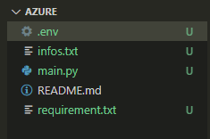
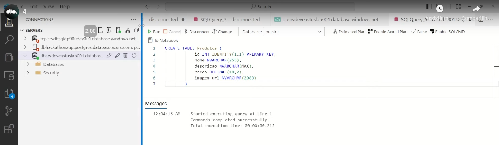
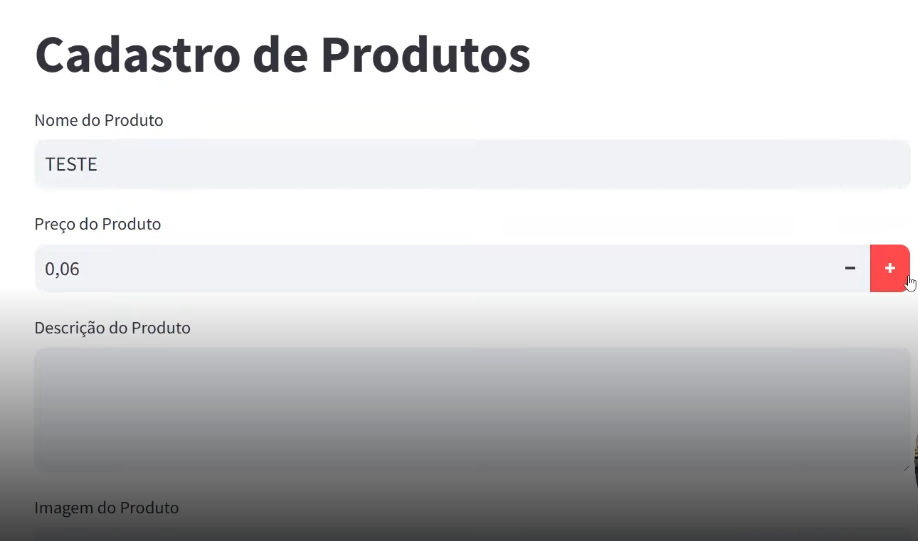

# azure - Bootcamp Microsoft Azure Cloud Native - DIO

Projeto - Armazenando dados de um e-commerce na Cloud

- front-end, usando Python ou Streamlit
- criar cards no Python com cadastro dos itens e imagens (usar persistência de dados e storage para listar imagem)

PASSOS:
1. Em Python, cria-se: arquivo main.py, requirement.txt, infos.txt, o .env e o README.md
2. No Azure Portal, cria-se o banco de dados, (SQL database),, a Storage Account, um Container (“Fotos”)

Configurando o Banco de Dados e Criando a tabela de produtos

No terminal do Python: pip install -r requirement.txt
Com o comando: “streamlit run main.py” se cria o ambiente abaixo. 

